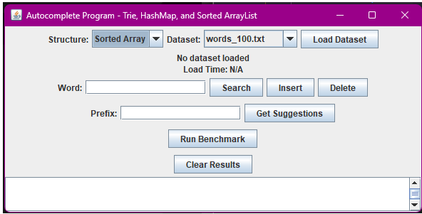
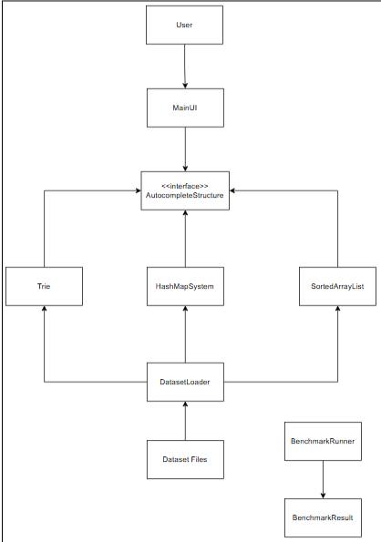
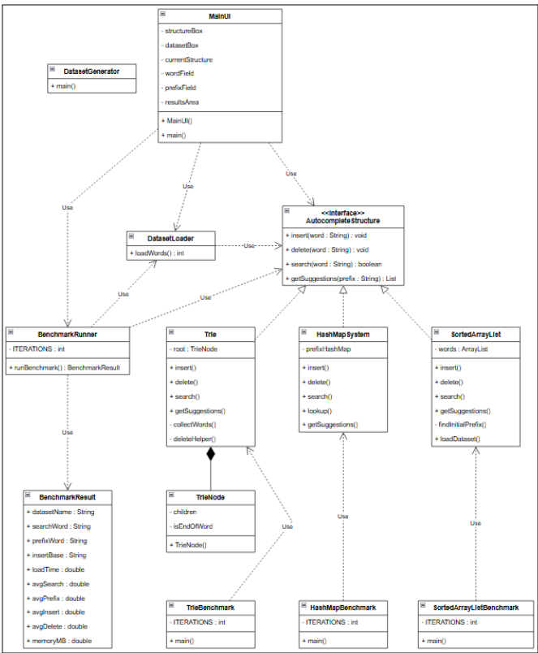

# Performance Comparison of Trie, HashMap, and Sorted ArrayList in an Autocomplete Program

<p align="center">
  
</p>


---

## Project Overview

This repository contains the source code, datasets, benchmarking files, and reports for a Data Structures final project that compares the performance of three autocomplete implementations:

- Trie
- HashMap
- Sorted ArrayList

The project evaluates:

- Dataset loading time (ms)
- Prefix search speed (ns)
- Insertion speed (ns)
- Deletion speed (ns)
- Exact lookup speed (ns)
- Memory usage (MB)
- Scalability
- Theoretical time complexity vs Final time complexity

Note that the testing will take place in Renji’s PC with these specifications:

- CPU: AMD Ryzen 5 5600 6-Core Processor (12 CPUs), ~3.5GHz
- Memory: 16384MB RAM
- Operating System: Windows 11 pro 64-bit (10.0, Build 26200)

---

## Quick Links

- 📄 Data Structures Report: https://docs.google.com/document/d/1Gv1QPSBOIifG12q4DnK7RZ5Ra1F5EuOMN59h4Pf3g8c/edit?tab=t.bp0si8anjy3e
- 📄 OOP Report: https://docs.google.com/document/d/1Gv1QPSBOIifG12q4DnK7RZ5Ra1F5EuOMN59h4Pf3g8c/edit?tab=t.0
- 📊 Raw Benchmark Results: https://docs.google.com/spreadsheets/d/1js1JTCgj572451xxZB2vJC9xbKhmUcKjTqukPu13jJQ/edit?gid=0#gid=0
- 📁 Dataset Source: https://github.com/dwyl/english-words, words_alpha.txt

---

## Team Members

| Name | Student ID | Responsibility |
|--------|--------|--------|
| Muhammad Dafi Arib Asyrofi | 2902718944 | Trie Implementation, UI Development, GitHub Repository Initialization |
| Febrian Haliesius | 2902724745 | HashMap Implementation, UI Development |
| Renjiro Kunio Handoko | 2902740591 | Sorted ArrayList Implementation, UI Development, Benchmark Testing |

---

## System Architecture

### System Architecture Flowchart

<p align="center">
  
</p>

The image above shows the entirety of the system architecture. First, the user communicates with the application through the MainUI component. Then, MainUI sends signal through AutocompleteStructure interface, which provides common set of operations such as insertion, deletion, exact lookup, and prefix search. Trie, HashMap, and Sorted ArrayList implements AutocompleteStructure interface the same way. For datasets, these are loaded through DatasetLoader component and inserted into each data structure. For benchmarking, the BenchmarkRunner component run testings on the selected data structure and print out the results inside BenchmarkResults.


### Unified Class Diagram

<p align="center">
  
</p>

The image above shows the unified diagram of the system. In addition to the image above, the Trie class contains TrieNode objects through a composition relationship, while BenchmarkRunner and DatasetLoader provide benchmarking and dataset management functionalities and other classes doing their functions.

---

## User Interface

<p align="center">
  
</p>

The image above shows the graphical user interface for the autocomplete program made using Java Swing (Runestone Academy, n.d.). As shown in image above, users can select a data structure (Trie, HashMap, or Sorted ArrayList) and select dataset (100, 1k, 10k, 20k, 50k, 75k, 100k, 200k, and 300k) to load into the selected data structure. After dataset has been loaded, user can type a word and perform the selected operations (search/exact lookup, insert, and delete). Users can also type letters in the prefix placeholder (for example, “ap”) and click the “Get Suggestions” button to get the words that start with the typed letter “ap” in the result area. Users can also click the “Clear Results” button to clear whatever printed out in the result area for clarity (Bro Code, 2020). All of this are learnt from the youtube video which can be accessed here: https://www.youtube.com/watch?v=Kmgo00avvEw and with the little help of some internet searching, same applies with the implementation process of the 3 data structures here in the report and the code.


Users can:

- User selects a data structure implementation (Trie, HashMap, or Sorted ArrayList) from the structure dropdown menu.
- User selects a dataset file from the dataset selection dropdown menu.
- User presses the Load Dataset button.
- The system calls the DatasetLoader component to read words from the selected dataset text file.
- The loaded words are inserted into the selected data structure through the AutocompleteStructure interface.
- After the dataset has been loaded successfully, the user can perform autocomplete operations.
- For an exact lookup search, user can enter a word and presses the Search button. The system will check whether the typed word exists in the selected data structure and displays the result.
- For insertion, user can enter a new word and presses the Insert button. The word is then added to the selected data structure.
- For deletion, user can enter an existing word and presses the Delete button. The word is then removed from the selected data structure.
- For suggestions, user can enter a prefix and presses the Get Suggestions button. The system will retrieve and display all matching words that begin with the typed prefix.
- During benchmarking, the BenchmarkRunner component executes the testing and print out the results on the selected data structure.
- The benchmark results are stored in the BenchmarkResult object.

---

## Data Structures

### Trie

A trie is a tree-based data structure where each node has exactly one character/letter and paths from the root node that eventually forms a complete word. A parent node can have many children, depending on the word being inserted. Words that share the same prefix character/letter will share the same character/letter path, which reduces duplication and improves perfomance.

Each node contains a collection of child nodes stored in `HashMap(HashMap<Character, TrieNode> children)` and a boolean variable `boolean isEndOfWord = true` or `boolean isEndOfWord = false` which indicates whether the current node is the end of a word or otherwise.

### HashMap

Main data structure used is a prefix hashmap which is:

`Hashmap<String, Hashmap<String, Integer>>`

This represents `prefix → (word → frequency)` so each prefix will store a hashmap which contains a word and frequency key-value.

Example:

`"ap" → { "apple" : 5, "app" : 3, "application" : 2 }`

### Sorted ArrayList

The main data is stored inside an `ArrayList<String>` which the words will be stored in an alphabetical order.

Example:

`[“apple”, “banana”, “cat”, “dictionary”]`

`ArrayList<String>` is used because of how it allows access to the variable based on the index and how it supports binary search if the data is already sorted.

---

## Final Time Complexity

| Operation | Trie | HashMap | Sorted ArrayList |
|------------|------------|------------|------------|
| Insert | O(L) | O(L) | O(n) |
| Delete | O(L) | O(L) | O(n) |
| Search (Exact Lookup) | O(L) | O(1) | O(log n) |
| Prefix Search | O(L + K) | O(K log K) | O(log n + K) |

Where:

- L = word length
- K = number of suggestions
- n = total number of words in the dataset

---

## Key Findings

- HashMap achieved the fastest exact lookup.
- Sorted ArrayList achieved the fastest prefix search and dataset loading time.
- Sorted ArrayList used the least memory.
- Trie has the fastest insertion and deletion time.
- Trie provided the most balanced overall performance.
- Final time complexity analysis results perfectly matches theoretical time complexity analysis.

---

## Running the Program

Clone the repository:

```bash
git clone https://github.com/Dafz-7/datastructure-final-project
```

Run:

```text
src/ui/MainUI.java
```

---

## Running Benchmarks

Execute one of the following files:

```text
src/hashmap/HashMapBenchmark.java
src/sortedarraylist/SortedArrayListBenchmark.java
src/trie/TrieBenchmark.java
```

---

## Dataset Sizes

The project benchmarks the following dataset sizes:

- 100 words
- 1,000 words
- 10,000 words
- 20,000 words
- 50,000 words
- 75,000 words
- 100,000 words
- 200,000 words
- 300,000 words

---

## Raw Benchmark Results

https://docs.google.com/spreadsheets/d/1js1JTCgj572451xxZB2vJC9xbKhmUcKjTqukPu13jJQ/edit?gid=0#gid=0

---

## References

See the complete report for full references.